# Continuum
Continuum is an agent centric memory engine providing short-, mid- and long-term memory (STM/MTM/LTM) across sessions. It uses a vector store, scored retrieval and LLM-powered memory evolution, exposed via FastAPI so any agent framework can plug into it.

<picture>
  <!-- in dark mode, show the white-on-transparent image -->
  <source srcset="documentation/DarkEr.svg" media="(prefers-color-scheme: dark)">
  <!-- in light mode, show the dark-on-transparent image -->
  <source srcset="documentation/lightEr.svg" media="(prefers-color-scheme: light)">
  <!-- fallback (will be used if the browser doesn’t support <picture>) -->
  
</picture>
